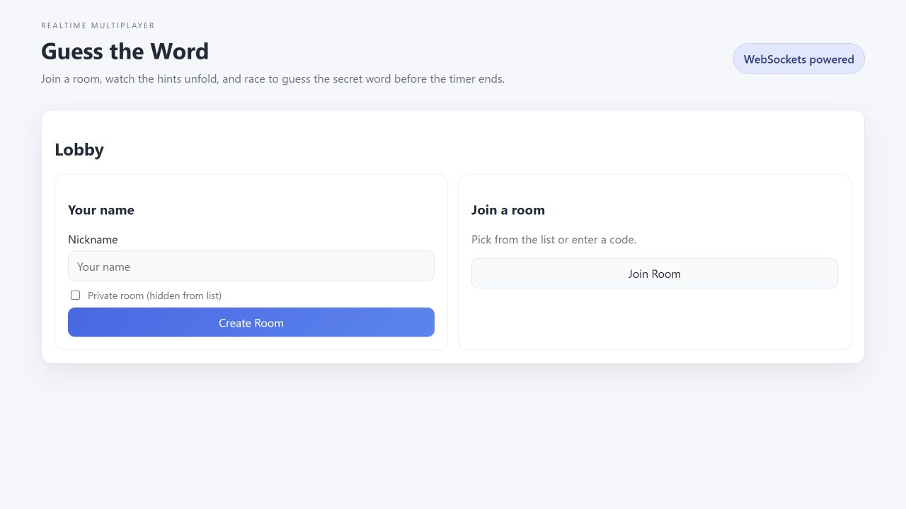

# Guess the Word

A real-time multiplayer browser game built with Node.js, Express, Socket.IO, and vanilla JavaScript.

[](https://github.com/im24a-gesztelyif/guess-the-word/actions/workflows/ci.yml)



## Implemented features

- Public and private rooms with four-character join codes
- Host-controlled round duration, round count, and word packs
- Progressive hints and time-based scoring
- First-correct bonus, skip voting, and final standings
- Synchronized room, round, timer, and scoreboard state
- Host migration and room cleanup when players disconnect
- Responsive frontend built without a client framework

## Technology stack

- Node.js and Express
- Socket.IO
- Vanilla JavaScript, HTML, and CSS

## Architecture

The Express server serves the static frontend and owns all game state in memory. Socket.IO events synchronize lobby listings, room membership, round timing, guesses, scores, and host actions. Rooms are intentionally temporary and disappear when the server restarts.

## Setup

```bash
npm install
npm start
```

Open [http://localhost:3000](http://localhost:3000), create a room, and share its code with another browser window.

## Configuration

The server uses port `3000` by default and accepts a `PORT` environment variable. Word packs are stored with the server source and can be extended without changing the client.

## Verification

```bash
npm test
```

The smoke test starts the real server on an isolated port, requests the home page, and shuts the process down.

## Limitations

- Room state is stored in memory rather than a database.
- The project is designed for learning and small demonstrations, not untrusted production traffic.
- Horizontal scaling would require shared room state and a Socket.IO adapter.

## Project context

This is a personal learning project focused on real-time multiplayer state, event-driven server code, and a framework-free browser interface.

## Learning outcomes

The project strengthened my understanding of WebSocket events, authoritative server state, disconnect handling, timers, and keeping multiple browser clients synchronized.
